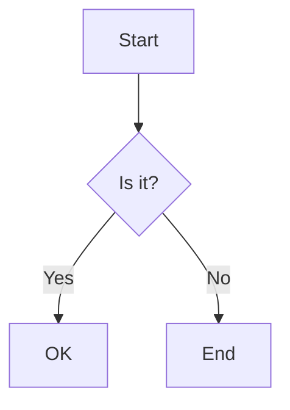
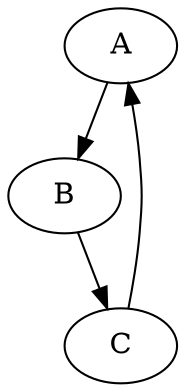

# Excluded Features Test

This file tests content that uses features excluded from Quick Look.

## MathJax (Should Render as Plain Text)

Inline math: $x^2 + y^2 = z^2$

Display math:

$$
\frac{-b \pm \sqrt{b^2-4ac}}{2a}
$$

More math: $\sum_{i=1}^{n} i = \frac{n(n+1)}{2}$

## Mermaid Diagrams (Should Render as Code Block)

## Graphviz/DOT (Should Render as Code Block)

## Regular Content (Should Render Normally)

This paragraph should render normally.

| Column 1 | Column 2 |
|----------|----------|
| Cell 1   | Cell 2   |
| Cell 3   | Cell 4   |

- List item 1
- List item 2

**Bold** and *italic* should work fine.
