# Manual Testing Plan: Mermaid Gantt Diagram Rendering Fix (Issue #18)

**Issue:** Mermaid gantt diagram rendering issues (today's indicator missing, x-axis label overlap)
**Fix:** Removed external `mermaid.forest.css` loading; use Mermaid 8.0+ theme API with `theme: 'forest'`
**Branch:** claude/fix-issue-18-01VvFppPfidfrm55767bTco1
**Commit:** fbbda69

---

## Background

The fix addresses two critical issues with Mermaid gantt charts:
1. **Missing today's indicator line:** The vertical line marking today's date was disappearing when `dateFormat` was not explicitly set
2. **X-axis date label overlap:** Date labels on the x-axis were overlapping, making the chart unreadable
3. **Theme preservation:** Maintain the forest theme (green colors) appearance

**Root Cause:** External `mermaid.forest.css` stylesheet was interfering with Mermaid's internal theming system, preventing proper rendering logic from executing.

**Solution:** Use Mermaid 8.0+ built-in theme API by setting `theme: 'forest'` in `mermaid.initialize()` and removing the external CSS loading.

---

## Pre-Testing Setup

### Build and Launch
1. Open `MacDown 3000.xcworkspace` in Xcode
2. Build the project (Cmd+B)
3. Run the application (Cmd+R)
4. Verify the application launches without errors
5. Create a new test document: `mermaid-gantt-test.md`

### Prepare Test Markdown Files

Create the following test files in a dedicated test folder:

---

## Test Scenarios

### Test 1: Gantt Chart with Implicit dateFormat (No explicit dateFormat set)

**Objective:** Verify that today's indicator appears even without explicit `dateFormat`

**Test File Content:**
```markdown
# Test 1: Gantt Chart - No Explicit dateFormat

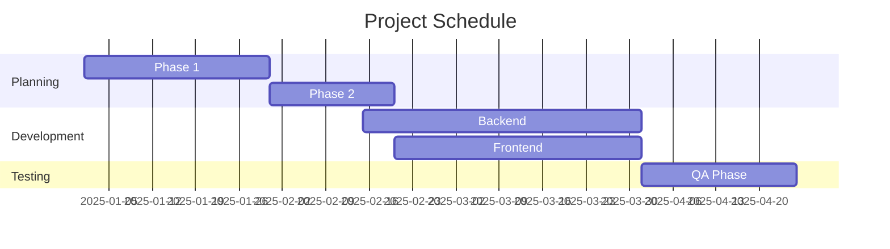
```

**Expected Results:**
- Gantt chart displays correctly
- **CRITICAL:** A vertical red/blue line indicating "today" is visible on the chart
- Line is positioned on the current date (2025-11-20 or close to it based on system date)
- All tasks are displayed with correct durations
- X-axis date labels are readable and not overlapping
- Chart uses forest theme colors (green tones for tasks)

**Pass/Fail:** [ ]

**Notes for Tester:**
- The today indicator should be clearly visible as a vertical line crossing the gantt chart
- If missing, the fix was unsuccessful

---

### Test 2: Gantt Chart with Explicit dateFormat

**Objective:** Verify today's indicator still works with explicit `dateFormat` configured

**Test File Content:**
```markdown
# Test 2: Gantt Chart with Explicit dateFormat

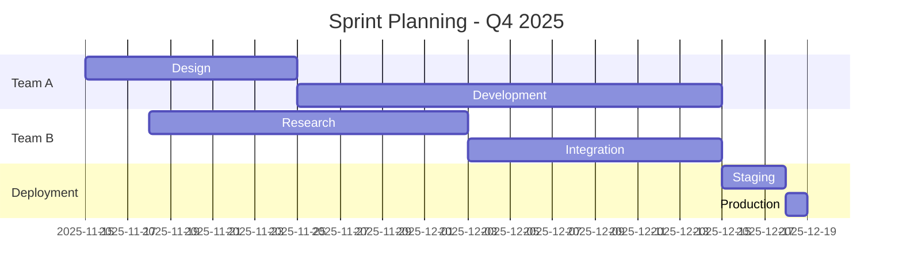
```

**Expected Results:**
- Today's indicator line appears and is positioned at 2025-11-20 (or current system date)
- All dates format correctly as YYYY-MM-DD
- X-axis shows date labels clearly without overlap
- Forest theme colors are applied to all task bars
- Chart dimensions and spacing are appropriate

**Pass/Fail:** [ ]

---

### Test 3: Gantt Chart with Dependencies and Milestones

**Objective:** Verify complex gantt charts with task dependencies render correctly

**Test File Content:**
```markdown
# Test 3: Gantt Chart with Dependencies and Milestones

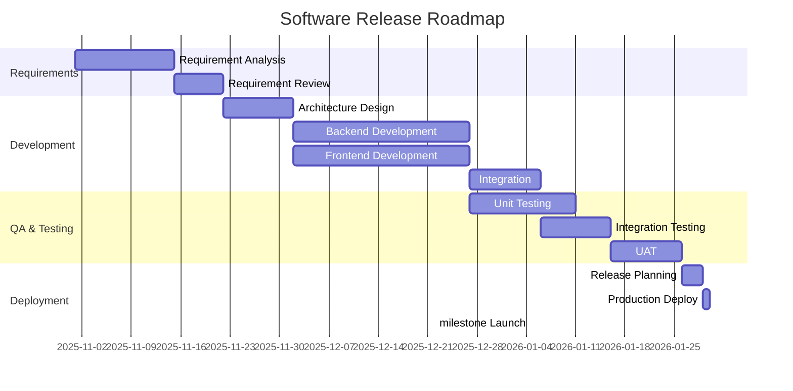
```

**Expected Results:**
- All tasks display with correct dependency arrows
- Dependencies are properly visualized (task bars align with their dependent tasks)
- Today's indicator line is visible
- Milestone marker is displayed
- X-axis labels don't overlap despite the chart being complex
- Forest theme colors distinguish different sections
- Chart is horizontally scrollable if needed to see all tasks

**Pass/Fail:** [ ]

---

### Test 4: Gantt Chart with Different Date Formats

**Objective:** Verify different dateFormat configurations all work correctly

**Test File Content:**
```markdown
# Test 4: Gantt Charts with Different Date Formats

## Format: YYYY-MM-DD


```

## Format: DD/MM/YYYY

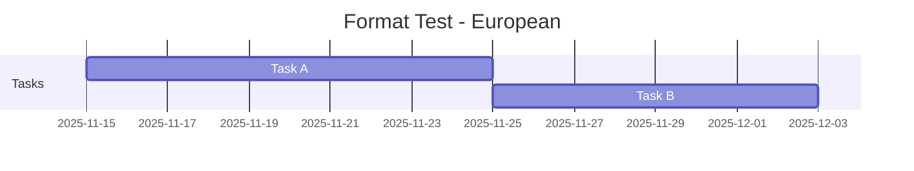
```

## Format: YYYY-MM-DD HH:mm

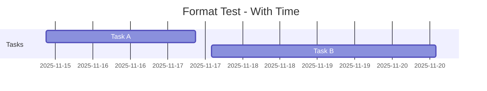
```

**Expected Results:**
- All three charts render successfully
- Each chart displays today's indicator line
- Date formats are correctly interpreted
- No "Invalid date" errors appear
- X-axis labels match the dateFormat in each chart
- All charts maintain forest theme styling

**Pass/Fail:** [ ]

---

### Test 5: Gantt Chart with Edge Case Dates

**Objective:** Verify gantt charts handle edge case dates correctly

**Test File Content:**
```markdown
# Test 5: Gantt Chart - Edge Case Dates

## Long Duration Task

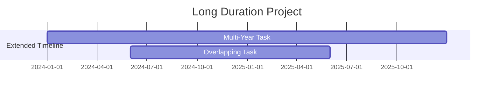
```

## Single Day Tasks

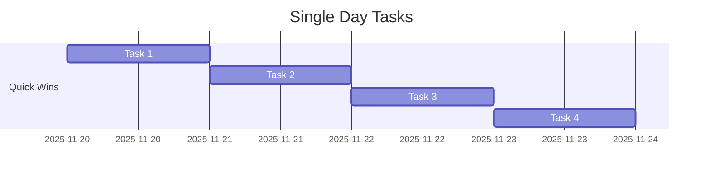
```

## Historical Dates (Before Today)

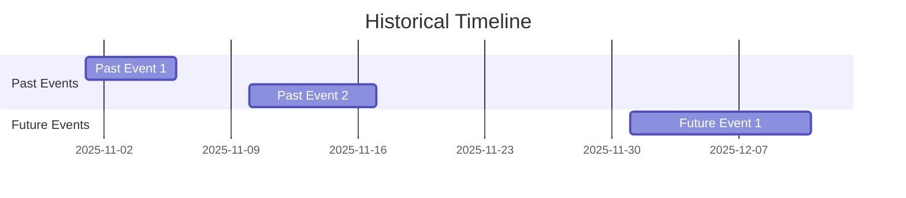
```

**Expected Results:**
- Long duration tasks span across many months without rendering issues
- Single day tasks render with appropriate dimensions
- Today's indicator divides past and future tasks appropriately
- Historical dates (before today) render correctly on the left side
- Future dates (after today) render correctly on the right side
- No date parsing errors or rendering glitches

**Pass/Fail:** [ ]

---

### Test 6: Gantt Chart X-Axis Label Overlap Verification

**Objective:** Specifically verify that x-axis date labels don't overlap (main fix)

**Test File Content:**
```markdown
# Test 6: X-Axis Label Spacing - Overlap Check

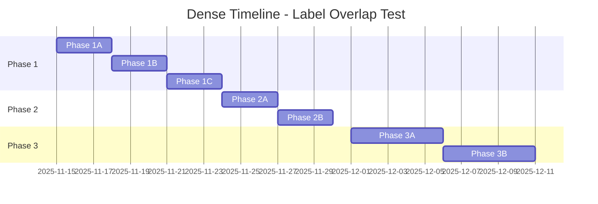
```

**Expected Results:**
- **CRITICAL:** X-axis date labels are readable and clearly spaced
- No overlapping or illegible date labels
- Date labels may be rotated at an angle for readability (acceptable)
- Labels don't obscure any part of the task bars
- Scroll horizontally if the chart is wide; labels remain readable
- Today's indicator line is clearly visible and doesn't interfere with label readability

**Pass/Fail:** [ ]

**Visual Inspection Checklist:**
- [ ] Date labels are fully visible
- [ ] No text overlap in date labels
- [ ] Spacing between date labels is adequate
- [ ] Today's indicator doesn't obstruct labels
- [ ] Chart is visually balanced and professional-looking

---

### Test 7: Other Mermaid Diagram Types (Regression Check)

**Objective:** Ensure the fix didn't break other Mermaid diagram types

**Test File Content:**
```markdown
# Test 7: Other Mermaid Diagram Types - Regression Check

## Flowchart

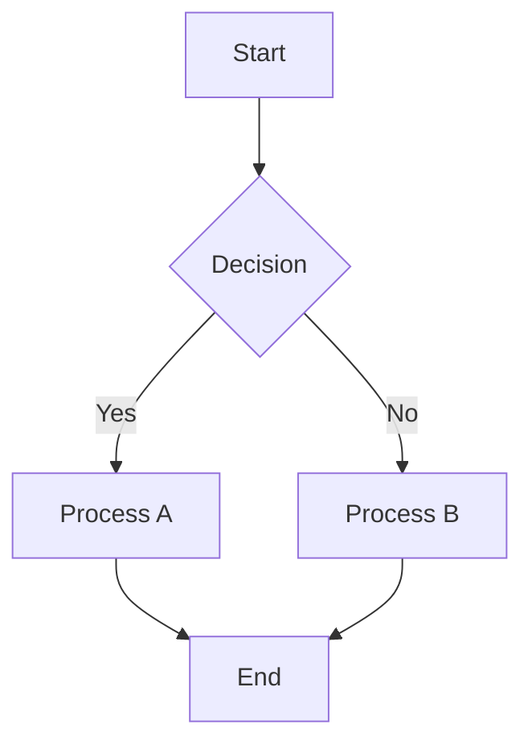
```

## Sequence Diagram

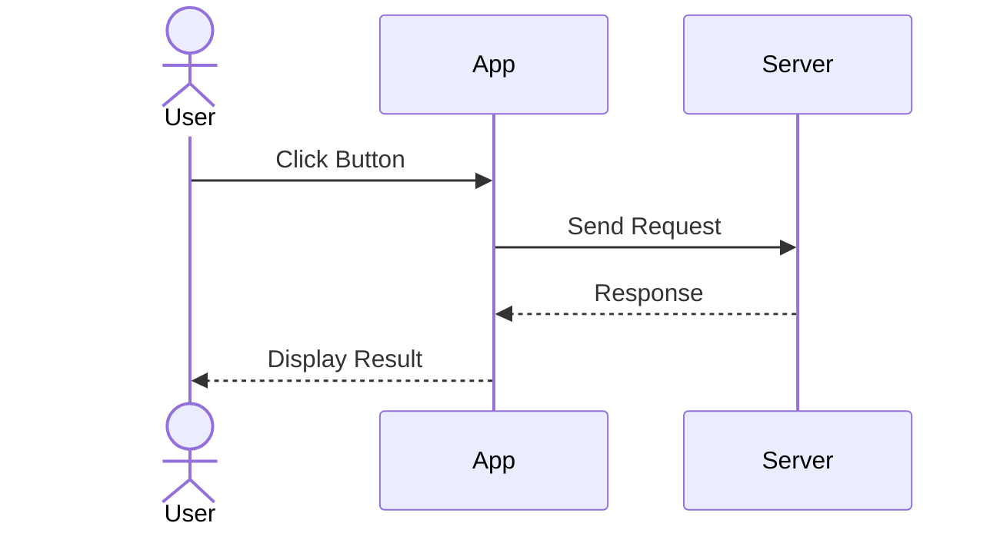
```

## Class Diagram

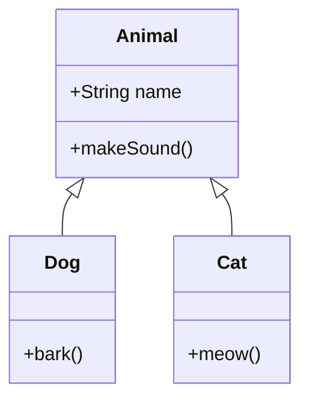
```

## State Diagram

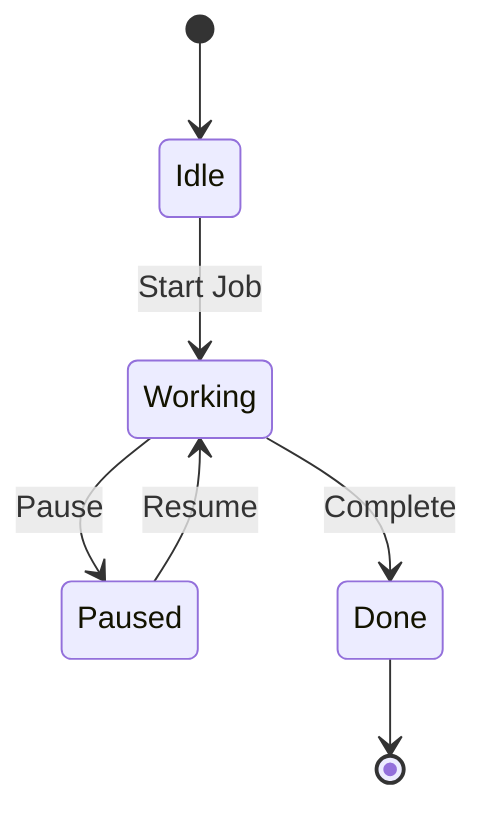
```

## Pie Chart

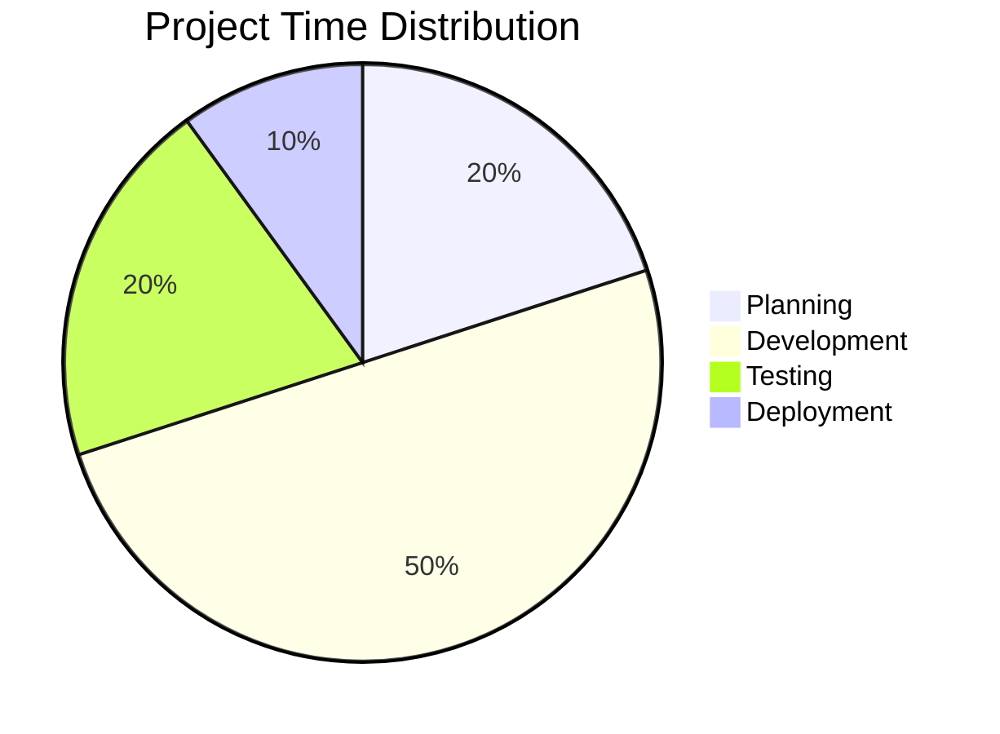
```

**Expected Results:**
- All diagram types render without errors
- Flowchart shows all nodes, connections, and proper formatting
- Sequence diagram displays interactions and timing correctly
- Class diagram shows relationships and class definitions
- State diagram shows state transitions
- Pie chart displays proportions correctly
- Forest theme is applied where applicable (colors consistent)
- No JavaScript errors in browser console

**Pass/Fail:** [ ]

---

### Test 8: Gantt Chart Rendering in Preview Pane

**Objective:** Verify gantt charts render smoothly in the live preview pane

**Test File Content:**
```markdown
# Test 8: Live Preview Rendering

Create a document with multiple gantt charts and verify live preview behavior.

## Chart 1: Simple Gantt

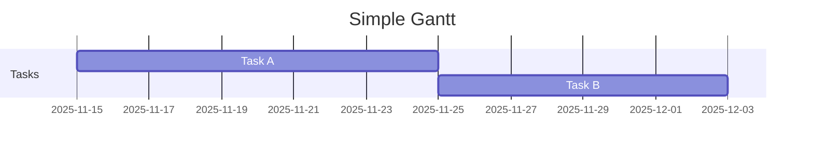
```

## Editing Test

Edit the above gantt chart in real-time:
1. Change task dates
2. Add new tasks
3. Change task durations
4. Modify the title
```

**Testing Steps:**
1. Open the test file
2. Ensure preview pane is visible (split view)
3. Edit the gantt chart content in the editor
4. Observe the preview pane as you make changes

**Expected Results:**
- Preview updates smoothly as you edit gantt syntax
- Changes appear in preview without complete page reload
- Today's indicator updates correctly
- X-axis labels recalculate and remain readable
- No flickering or flashing of the preview pane
- Forest theme styling is maintained
- Gantt chart renders correctly even with incomplete/partial code during editing

**Pass/Fail:** [ ]

---

### Test 9: Gantt Chart Export to HTML

**Objective:** Verify gantt charts export correctly to HTML/PDF

**Testing Steps:**
1. Open the document with multiple gantt charts (from Test 1-6)
2. Export to HTML: File → Export → HTML
3. Open the exported HTML in a web browser
4. Verify gantt diagrams render correctly in the exported file

**Expected Results:**
- HTML file is generated without errors
- All gantt charts render in the browser
- Today's indicator lines are visible in exported charts
- Date labels are readable in exported HTML
- Forest theme styling is preserved
- Charts are responsive and properly sized
- All other diagram types also display correctly in exported HTML

**Pass/Fail:** [ ]

---

### Test 10: Gantt Chart with Complex Markdown Mix

**Objective:** Verify gantt charts work correctly alongside other Markdown content

**Test File Content:**
```markdown
# Comprehensive Project Plan

## Executive Summary

This document outlines the complete project timeline with various diagrams and formatting.

### Key Dates
- Project Start: 2025-11-15
- Expected Completion: 2025-12-20
- Status: **In Progress**

## Project Timeline

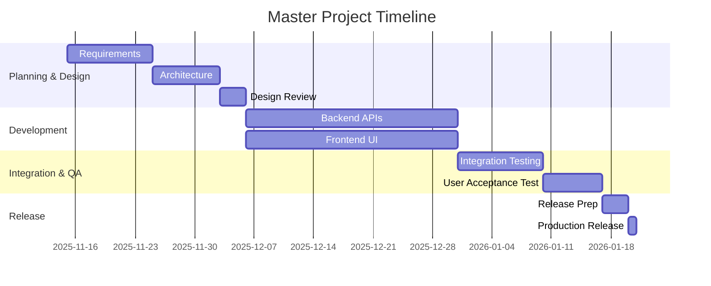
```

## Detailed Phases

### Phase 1: Requirements & Design (Nov 15 - Dec 3)
- Gather stakeholder requirements
- Create technical specifications
- Design system architecture
- Conduct design review meeting

### Phase 2: Development (Dec 3 - Jan 6)
Backend development includes:
1. API endpoint creation
2. Database schema design
3. Security implementation

Frontend development includes:
1. Component library setup
2. UI page implementation
3. Integration with backend APIs

## Team Schedule

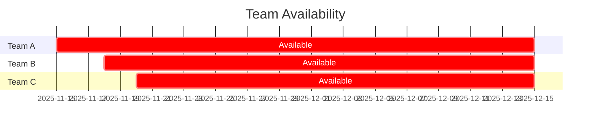
```

## Risk Timeline

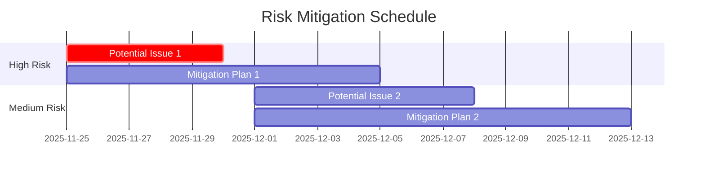
```

## Success Criteria
- [ ] All timeline milestones met
- [ ] Quality metrics achieved (95%+ test coverage)
- [ ] Zero critical bugs in production
- [ ] Team satisfaction rating > 4/5

---

*Last Updated: 2025-11-20*
```

**Expected Results:**
- Entire document renders without errors
- Multiple gantt charts all display correctly
- Today's indicator appears in each gantt chart
- Date labels are readable and don't overlap in any chart
- Text formatting (bold, lists, etc.) is preserved
- Mixing Markdown content with Mermaid diagrams works seamlessly
- Forest theme is consistently applied across all charts

**Pass/Fail:** [ ]

---

## Success Criteria

The fix is successful if **ALL** of the following are true:

1. ✅ **Today's indicator appears** in all gantt charts, regardless of explicit `dateFormat` setting
2. ✅ **X-axis date labels are readable** with no overlapping text
3. ✅ **Forest theme colors** are properly applied (green tones for tasks)
4. ✅ **Other Mermaid diagram types** continue to work without regressions
5. ✅ **Gantt charts render correctly** in preview pane updates
6. ✅ **Export to HTML/PDF** preserves gantt diagram styling
7. ✅ **No JavaScript errors** appear in the browser console during preview
8. ✅ **No visual glitches** (missing elements, distorted charts, overlapping content)

---

## Failure Criteria

Report as a bug if **ANY** of the following occur:

1. ❌ Today's indicator line is missing in gantt charts
2. ❌ X-axis date labels overlap or are illegible
3. ❌ Forest theme colors are not applied (charts appear unstyled)
4. ❌ Other Mermaid diagram types fail to render or appear broken
5. ❌ Gantt chart causes JavaScript errors in console
6. ❌ Gantt charts don't update correctly in preview pane during editing
7. ❌ Export to HTML results in broken or unstyled diagrams
8. ❌ Visual distortions or rendering glitches appear
9. ❌ Application crashes when rendering gantt charts

---

## Testing Checklist Summary

- [ ] Test 1: Gantt Chart - No Explicit dateFormat
- [ ] Test 2: Gantt Chart with Explicit dateFormat
- [ ] Test 3: Gantt Chart with Dependencies and Milestones
- [ ] Test 4: Gantt Charts with Different Date Formats (3 charts)
- [ ] Test 5: Gantt Chart - Edge Case Dates (3 charts)
- [ ] Test 6: X-Axis Label Spacing - Overlap Check
- [ ] Test 7: Other Mermaid Diagram Types (5 types)
- [ ] Test 8: Live Preview Rendering
- [ ] Test 9: Gantt Chart Export to HTML
- [ ] Test 10: Gantt Chart with Complex Markdown Mix (3 charts)

**Total Test Cases:** 10 primary scenarios with 25+ sub-tests

---

## Notes for Tester

### Understanding "Forest Theme" Appearance

**Expected Visual Characteristics:**
- Task bars are green/teal colored (forest theme)
- Section backgrounds are light (typically white or very light gray)
- Text is dark/black on light backgrounds
- Today's indicator is a contrasting vertical line (typically red or dark blue)
- Overall palette is calm and professional-looking

### What to Look For: Today's Indicator Line

**Correct Behavior:**
- A vertical line clearly visible on the gantt chart
- Positioned at the current date on the timeline
- Contrasts with the rest of the chart for visibility
- Remains in place when previewing/exporting

**Incorrect Behavior (Bug):**
- No vertical line visible
- Line is hidden or very faint
- Positioned at wrong date
- Disappears during certain actions (editing, scrolling)

### What to Look For: X-Axis Label Readability

**Correct Behavior:**
- Date labels clearly visible along the x-axis
- No overlapping text
- Adequate spacing between labels
- Legible font size
- Labels may be angled but still readable

**Incorrect Behavior (Bug):**
- Labels overlapping each other
- Labels illegible or too small
- Labels obscuring chart content
- Missing labels entirely

### Browser Console Inspection

To check for JavaScript errors:
1. Open Developer Tools (usually F12 or Cmd+Option+I)
2. Navigate to Console tab
3. Look for any red error messages related to "mermaid" or diagram rendering
4. Report any errors found

### Recording Results

For each test:
1. Mark **Pass** or **Fail** in the checkbox
2. Note any observations or unexpected behavior
3. If failed, describe what went wrong
4. Record system information if relevant

---

## Environment Information

**Please fill in during testing:**

- **macOS Version:** _______________
- **Hardware:** _______________
- **Build Date/Time:** _______________
- **Xcode Version:** _______________
- **Tester Name:** _______________
- **Test Date:** _______________
- **Browser (for HTML export):** _______________

---

## Additional Testing Recommendations

1. **Real-World Usage:**
   - After completing formal tests, use MacDown with actual Mermaid gantt charts
   - Create project timelines or schedule documents
   - Verify smooth performance with larger, more complex diagrams

2. **Performance Testing:**
   - Test with very large gantt charts (50+ tasks)
   - Monitor CPU usage while previewing
   - Check for lag or delays in rendering

3. **Cross-Platform (if applicable):**
   - Test on different macOS versions (10.14+)
   - Test with different display resolutions
   - Verify on both retina and non-retina displays

4. **Documentation:**
   - If successful, update user documentation about Mermaid gantt chart support
   - Add examples to help documentation

---

## Reporting Issues

If any test fails, please report:

1. **Test number and name**
2. **Steps to reproduce** (provide the Markdown code that causes the issue)
3. **Observed behavior** (what went wrong)
4. **Expected behavior** (what should have happened)
5. **Screenshots or video** (if possible, capture the problem)
6. **System information** (macOS version, hardware, etc.)
7. **Browser console errors** (if any red errors appear)

---

## Related Issues and References

- **GitHub Issue:** #18 (Mermaid gantt diagram rendering issues)
- **Original Issue:** MacDownApp/macdown#1156
- **Commit:** fbbda69
- **Files Modified:**
  - MacDown/Code/Document/MPRenderer.m
  - MacDown/Resources/Extensions/mermaid.init.js

---

**End of Manual Test Plan**
